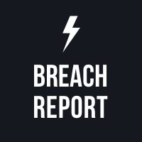

<h1 align="center">
  
   
  Breach Report API Documentation
</h1>

   
  
   
   

  <h4>
   | 
  <a href="./docs/01-before-using-api.md">
      Prepare
    </a>
	 | 
    <a href="./docs/02-check-email-domains.md">
      Check Emails / Domains
    </a>
     | 
    <a href="./docs/03-manage-emails-domains.md">
      Manage Account
    </a>
     | 
    <a href="04-monitor.md">
      Monitor
    </a>
     | 
    <a href="./docs/05-get-postback-url.md">
      Notifications
    </a>
     | 
    </h4>

<link rel="stylesheet" type="text/css" href="https://stackpath.bootstrapcdn.com/bootstrap/4.2.1/css/bootstrap.min.css">

<!-- &nbsp;&nbsp;&nbsp;&nbsp;&nbsp;&nbsp;&nbsp;&nbsp;&nbsp;&nbsp;&nbsp;&nbsp;&nbsp;&nbsp;&nbsp;&nbsp;&nbsp;&nbsp;&nbsp;&nbsp;&nbsp;&nbsp;&nbsp;&nbsp;&nbsp;&nbsp;&nbsp;&nbsp;&nbsp;&nbsp;&nbsp;&nbsp;&nbsp;&nbsp;&nbsp;&nbsp;&nbsp;&nbsp;&nbsp;
&nbsp;&nbsp;&nbsp;&nbsp;&nbsp;&nbsp;&nbsp;&nbsp;&nbsp;&nbsp;&nbsp;&nbsp;&nbsp;
]
] -->

## Overview

The Breach Report API team monitors the internet for information about data breaches. Currently, our database contains information about over 12B compromised user accounts. Your applications can access this information via Breach Report API.

## Getting started

Before using Breach Report API, make sure you've registered at [Breach Report API portal](https://breachreport.com) so you can get and use [the unique API key](docs/01-before-using-api.md/#getting-the-api-key).

When you use Breach Report API, include the key in each API call header.

## Testing Breach Report API

Breach Report API can be tested using various automation tools.

Contact the technical support for the additional API aids (request schemas, etc).

The following parameters can be specified via the test environment.

| PARAMETER | VALUE | COMMENTS |
| ------ | ------ | ------ |
| BASE_URL | `https://breachreport.com` |  |
| API_KEY | `your-secret-key` | See [Getting the API key](./docs/before-using-api.md#getting-the-api-key) for details. |

## How to Use Breach Report API

For detailed information on how to use the API, see the following pages:

* [Before Using Breach Report API](docs/01-before-using-api.md)
* [Checking Email Addresses and Domains](docs/02-check-email-domains.md)
* [Registering Email Addresses and Domains](docs/03-manage-emails-domains.md)
* [Monitoring Email Addresses and Domains](docs/04-monitor.md)
* [Getting Notifications](docs/05-postback-url.md)

## Contact

If you need help integrating with Breach Report API or need additional information, feel free to contact us on:

* [Facebook](https://www.facebook.com/breachreport/)
* [Twitter](https://twitter.com/BreachReports)

Or email us at support@breachreport.com. 

If you want to report a security issue, include the word "security" in the subject field. We take all issecurity issues very seriously!

We look forward to hearing from you.

And, we hope that you enjoy using Breach Report API and the integration goes smooth!

## Contributing to the Project

The main purpose of this repository is to let people know about Breach Report API, making it more functional, faster and easier to use.

You can contribute to the project by [creating a Breach Report account](./docs/01-before-using-api.md#registering-at-breach-report-portal) and getting a [paid subscription](#subscription-plans) or by reporting technical issues to the technical support at support@breachreport.com.

## Subscription Plans

Breach Report provides several Business and Enterprise subscription plans.

For information about the current subscription opportunities, see [Billing and Payments](https://breachreport.com/portal/subscriptions) on the Breach Report portal.

The subscription plans may have limitations for the number of domains to track and number of available API calls. To remove the current limitations, you may upgrade your current BR account.

For further information, contact the product support at support@breachreport.com.

   
  

