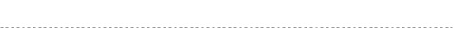
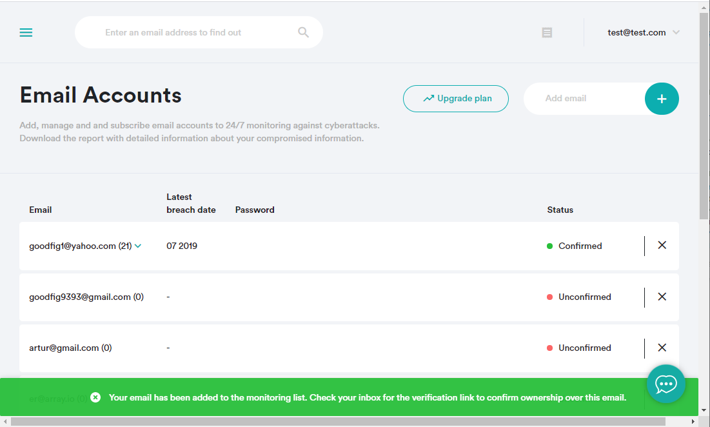

# Before Using Breach Report API

Things you must know before using Breach Report API:

* Your application must authenticate all calls to Breach Report API using a unique API key. To get the API key, you'll need to register at Breach Report portal.
* For greater security, Breach Report API provide full email incident data to the account holders only. To prove the account ownership, you must verify the email address by email.

## In this Chapter

* [Registering at Breach Report]()
* [Getting the API key]()
* [Adding an email address]()
* [Verifying an email address]()

## Registering at Breach Report Portal

To get the API key, you need to register at Breach Report portal.

To register a Breach Report account:

1. Go to the [Breach Report signup page](https://breachreport.com/portal/login).
2. Enter your credentials and click Sign Up.
3. Confirm your account using the link in the confirmation email.
4. After signing up, you can log in and generate your API key identifier.

   
  

## Getting the API Key

To get an API key:

1. Login in on the [Breach Report portal](https://breachreport.com/portal/).
2. Open the API section.
3. Click Create Key.

The page now displays the API key you've generated.

   
  

## Adding an Email Address

Registering at Breach Report portal automatically adds the registration email address to your account.

You can add more email addresses to your account via the portal or bu using

To add an email address via the portal:

1. Login in on the [Breach Report portal](https://breachreport.com/portal/).
2. Open the Email Accounts section.
3. Enter the email address in the **Add Email** field.
4. Confirm the operation by pressing Enter or by clicking the [+] button.

  
   

Alternatively, the address can be registered via the API.

   
  

## Verifying a Registered Email Address

Adding an email address to the account (via the portal or by email) automatically sends a confirmation request to the specified email address.

When adding an email address via the portal, a message appears in the bottom portion of the page.

  
   

To verify an email address, open the confirmation request message and verify it by clicking the confirmation link.
