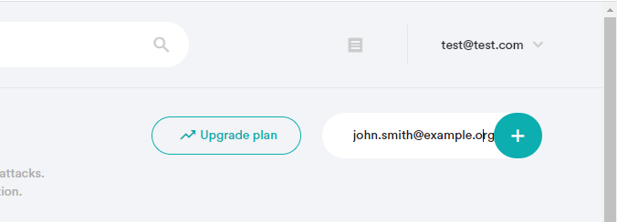

  <h4>
     | 
    <a href="../README.md">
      General Info
    </a>
     | 
    <a href="./02-check-email-domains.md">
      Check Emails / Domains
    </a>
     | 
    <a href="./03-manage-emails-domains.md">
      Manage Account
    </a>
     | 
    <a href="./04-monitor.md">
      Monitor
    </a>
     | 
    <a href="./05-postback-url.md">
      Notifications
    </a>
     | 
  </h4>

   
  

<h1 align="center">
  
   
  Before Using Breach Report API
</h1>

Using the API effectively requires initial preparation.  

   
  

## Things you must know first

Your application must authenticate all calls to Breach Report API using the API key. To get the API key, [register on the Breach Report portal](#registering-at-breach-report-portal).

To check the email addresses for breaches, you have the following options:

* Search information by the plaintext email address
* Search information by a SHA256 password hash
* Add the email address to the account and search information by Email ID

To check a web domain for compromised email addresses, add the domain to the account and search information by Domain ID.

For greater security, Breach Report API provides detailed information to proven account holders only.

To get the detailed information about an email address:

1. Add the email address to the account.
2. Verify the account ownership by email.
3. Search the information by Email ID.

To run the domain queries:

1. Add the domain to the account.
2. The Portal will generate a TXT record value. Add this value as a TXT entry to the domain registration records.
3. Search the information by Domain ID.

   
  

## In this Chapter

* [Registering at Breach Report](#registering-at-breach-report-portal)
* [Getting the API key](#getting-the-api-key)
* [Adding an email address](#adding-an-email-address)
* [Verifying an email address](#verifying-a-registered-email-address)
* [Adding a domain](#adding-a-domain)
* [Verifying a domain](#verifying-a-domain)
* [HTTP response codes](#http-response-codes)

   
  

## Registering at the Portal

Before getting the API key, register at the Breach Report portal:

1. Go to the [signup page](https://breachreport.com/portal/login).
2. Enter your credentials and click **Sign Up**.
3. Confirm your account by using the link in the confirmation email.
4. After signing up, you can log in and generate the API key identifier.

   
  

## Getting the API Key

To get the API key:

1. Login in on the [portal](https://breachreport.com/portal/).
2. Open the API section.
3. Click **Create Key**.

The page now displays the API key you've generated.

   
  

## Adding an Email Address

Registering at Breach Report portal automatically adds the registration email address to your account.

You can add more email addresses to your account via the portal or by using the API.

To add an email address via the portal:

1. Login in on the [portal](https://breachreport.com/portal/).
2. Open the **Email Accounts** section.
3. Enter the email address in the **Add Email** field.
4. Confirm the action by pressing Enter or by clicking the [+] button.

  
   

Or, you can register an email address via the API.

   
  

## Verifying a Registered Email Address

Adding an email address to the account (via the portal or by email) automatically sends a confirmation request to the specified email address.

When adding an email address via the portal, a message appears in the bottom portion of the page.

  
   

To verify an email address, open the confirmation request message and verify it by clicking the confirmation link.

   
  

## Adding a Domain

You can add domains to your account via the portal or by using the API.

To add an email address via the portal:

1. Login in on the [portal](https://breachreport.com/portal/).
2. Open the **Domains** section.
3. Enter the email address in the **Add Domain** field.
4. Confirm the operation by pressing Enter or by clicking the [+] button.

  
   

The registered domain is now displayed on the page.

Alternatively, you can register the domain via the API.

   
  

## Verifying a Domain

Verifying a domain requires adding a TXT record to the domain with the value you can get on the portal.

To add a TXT record to the domain:

Get the domain verification code. You can use the value that was returned by the [Add a Domain Name API call](./03-manage-emails-domains.md#add-a-domain-name). Or do the following steps:

1. Login in on the [portal](https://breachreport.com/portal/).
2. Open the **Domains** section.
3. Click **TXT** for the domain to verify. This copies the text you need to add to your domain records.  

Now, add a TXT record:

1. Go to your domain registrar's portal.
2. Follow the domain registrar's instruction for adding a TXT record.

Breach Report API will check the domain registration records, and it will change the domain status when it sees the updated records.

   
  

## HTTP Response Codes

With Breach Report API, you may get the following HTTP response codes.

| Code | Name | Description |
| ------ | ------ | ------ |
| 200 | OK | Request successfully fulfilled. Everything worked as expected. |
| 400 | Bad Request | Invalid domain URL or an invalid key. Check the API key on the [portal](https://breachreport.com/portal/user-api) section. |
| 402 | Payment required | You may need to upgrade your subscription. For further information, visit the [Subscription page on the portal](https://breachreport.com/portal/subscriptions) page. |
| 409 | Conflict | The domain name or the email address was registered before. Check your account for existing domains / emails. |
| 500 | Internal server error | Internal server error occured. If this issue persists, contact the support service. |
