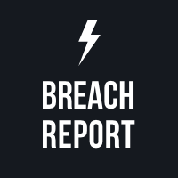

   
  
   
   

<link rel="stylesheet" type="text/css" href="https://stackpath.bootstrapcdn.com/bootstrap/4.2.1/css/bootstrap.min.css">

&nbsp;&nbsp;&nbsp;&nbsp;&nbsp;&nbsp;&nbsp;&nbsp;&nbsp;&nbsp;&nbsp;&nbsp;&nbsp;&nbsp;&nbsp;&nbsp;&nbsp;&nbsp;&nbsp;&nbsp;&nbsp;&nbsp;&nbsp;&nbsp;&nbsp;&nbsp;&nbsp;&nbsp;&nbsp;&nbsp;&nbsp;&nbsp;&nbsp;&nbsp;&nbsp;&nbsp;&nbsp;&nbsp;&nbsp;
&nbsp;&nbsp;&nbsp;&nbsp;&nbsp;&nbsp;&nbsp;&nbsp;&nbsp;&nbsp;&nbsp;&nbsp;&nbsp;
 ]

# Overview

The Breach Report API team monitors the internet for information about data breaches. Currently, our database contains information about over 12B compromised user accounts. Your applications can access this information via Breach Report API.

   
  
   

## Getting started

Before using Breach Report API, make sure you've registered at [Breach Report API portal](https://breachreport.com) so you can use [the unique API key](https://github.com/vissaly/brapi/blob/master/docs/get-api-key.md).

When you use Breach Report API, include the API key to each request header.

## Testing Breach Report API

Breach Report API can be tested using various automation tools.

Breach Report API request schema for Postman is available upon request.

https://www.getpostman.com/collections/123456

The following parameters can be specified via the test environment.

| PARAMETER | VALUE | COMMENTS |
| ------ | ------ | ------ |
| BASE_URL | `https://breachreport.com` |  |
| API_KEY | `your-secret-key` | See [Getting the API key](../before-using-api.md#getting-the-api-key) for details. |

## How to Use Breach Report API

* [Before Using Breach Report API]()
* [Check Email Addresses and Domains]()
* [Register Email Addresses and Domains]()
* [Monitor Email Addresses and Domains]()
* [Configure the Postback URL and Be Updated]()

## Contact

If you need help integrating with Breach Report API or need additional information, don't hesitate to contact us on:

* Telegram
* Stackoverflow
* Twitter

Or email us at info@breachreport.com. If you want to report a security issue, include the word "security" in the subject field.

We take security issues very seriously and we'll be looking forward to hearing from you.

And, we hope you enjoy using Breach Report API and the integration goes smooth!

## Contributing to the Project

The main purpose of this repository is to let people know about Breach Report API, making it more functional, faster and easier to use.

You can contribute to the project by creating a Breach Report account and getting a paid subscription or by reporting technical issues to the technical support at info@breachreport.com.

## Subscription Plans

Breach Report provides several Business and Enterprise subscription plans.

For information about the current subscription opportunities, see the Billing and Payments page on the Breach Report portal.

The subscription plans may have limitations for the number of domains to track and available API calls. To remove the current limitations, you may upgrade your current BR account.

For further information, contact the product support at info@breachreport.com.

## License

This project is licensed under the terms of the MIT license.

   
  

## API Response Codes

| Code | Name | Description |
| ------ | ------ | ------ |
| 200 | OK | Request successfully passed. |
| 400 | Bad Request | Invalid domain URL. Please check the Base URL value. |
| 401 | Unauthorized | The `API-Key` value is invalid or is missing from the header. Make sure that you have generated one at [Portal](https://breachreport.com/portal/user-api) section. |
| 402 | Payment required | You may need to upgrade your subscription. For further information, visit the [Subscription](https://breachreport.com/portal/subscriptions) page. |
| 409 | Conflict | The domain name or the email address was registered before. Check your account for existing domains / emails. |
| 500 | Internal server error | Internal server error occured. If this issue persists, contact our Support Service. |
